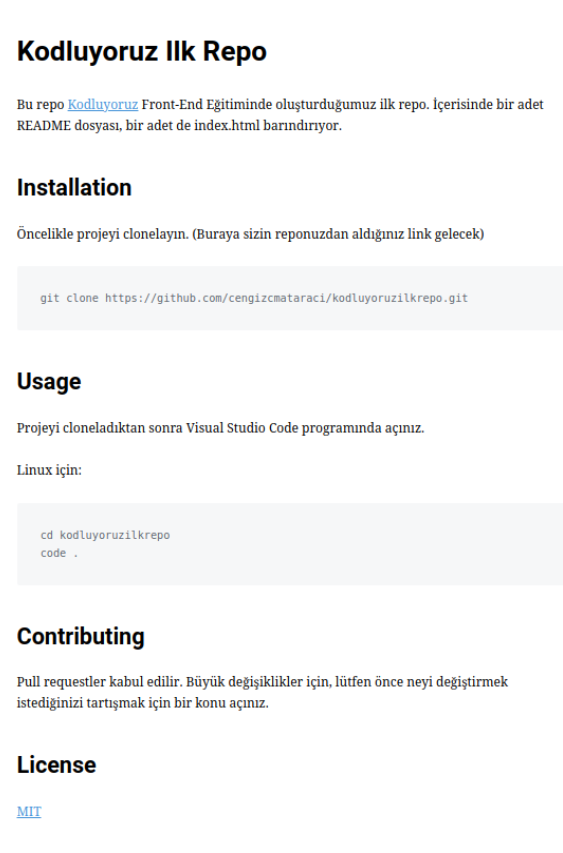

# Kodluyoruz Ilk Repo
Bu repo [Kodluyoruz](https://www.kodluyoruz.org/) Java Backend Eğitimi kapsamında oluşturduğum ilk repo. İçerisinde bir adet README dosyası, bir adet de index.html barındırıyor.

## Installation 
Öncelikle projeyi klonlayın. (Buraya sizin reponuzdan aldığınız link gelecek.)

```
[git clone] (https://github.com/codingisartt/kodluyoruzilkrepo)
```

## Usage
Projeyi clonladıktan sonra Visual Studio Code programında açınız.
Linux için:
```
cd Kodluyoruzilkrepo
code .
```
## Contributing
Pull requestler kabul edilir.Büyük değişiklikler için, lütfen önce neyi değiştirmek istediğinizi tartışmak için bir konu açınız.

## Licence
[MIT](https://github.com/codingisartt/kodluyoruzilkrepo/blob/main/LICENSE)



